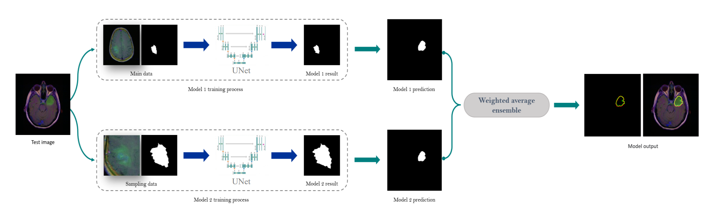

# Deep-ensemble-medical-image-segmentation-with-Exponential-loss-function
This repository contains code for a deep ensemble medical image segmentation approach, along with supporting files, based on the our published paper "A deep ensemble medical image segmentation with novel sampling method and loss function: link to your paper" ([link](https://www.sciencedirect.com/science/article/abs/pii/S0010482524003895)). The paper introduces a novel approach to medical image segmentation that tackles the challenges of class imbalance and achieving high accuracy. The proposed method leverages a deep ensemble consisting of two U-Net models with ResNet-101 backbones. One model is trained on the original dataset, while the other is trained on a specifically crafted dataset generated using a novel sampling method (code available in this [repository](https://github.com/AlirezaFBabaei/Sampling-Method)). This sampling method helps address class imbalance, a common issue in medical image datasets, by ensuring the model is exposed to both abundant background data and rare but crucial abnormal tissue data. The paper also proposes a novel loss function inspired by exponential loss, which operates at the pixel level to further enhance segmentation performance. The predictions from both ensemble models are combined using a weighted ensemble approach for improved segmentation accuracy.

## Key components:

*Main Model.ipynb*: This notebook implements the core U-Net model with a ResNet-101 backbone for medical image segmentation on the original dataset.

*Sampling Model.ipynb*: This notebook addresses class imbalance by training a separate U-Net model on a dataset created using a novel sampling method.

*Ensemble.ipynb*: This notebook demonstrates a weighted ensemble approach that combines predictions from both the main and sampling models for improved performance.

*Architecture.png*: This file visually depicts the overall architecture of the proposed deep ensemble method.

Further details and evaluation can be found in the referenced paper.

Note: This repository provides code for the core functionalities described in the paper. Additional functionalities like data loading and preprocessing might require adjustments based on your specific dataset.
